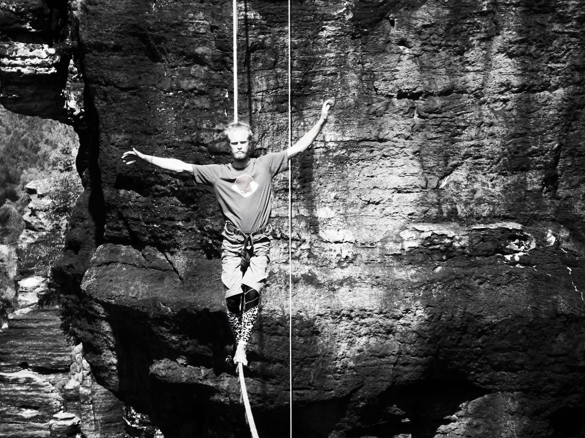

About
=====

Welcome to Viktor Söderqvist's home page!

This is a photo of me on "Narkobaron", a highline in Ostrov, Czech Republic. Photo by Gabrielle Nauta in August 2015.

I'm a slackliner, climber, programmer, inventor and such things.

I like the ideas of a free society and free information. I'm a skeptic to the concept of property (though it may be necessary to some extent for personal things), but intellectual property is something that I regard as complete bullshit. The world would be a so much better without it.

I'm a supporter of [share-alike](https://en.wikipedia.org/wiki/Share-alike) and [copyleft](https://en.wikipedia.org/wiki/Copyleft) licenses for intellectual and artistic works as means for the author/artist of granting anyone the freedom to share, copy, change, include in other works, delete or to do whatever they want with it, except using it to create non-free derivate works, thus preserving the freedom of the material. It's a way of using Copyright law against itself.

You can find some of my contributions to various free software projects on [my github account].

On this website I may publish articles and other material, if I ever would want to do that. The source code and the complete history of this website is available [here](https://github.com/zuiderkwast/zuiderkwast.se).

You can contact me by email on the address *viktor @ (the domain of this website)*.

My public GPG key can be found on keyservers. Let's exchange key fingerprints when we meet.
