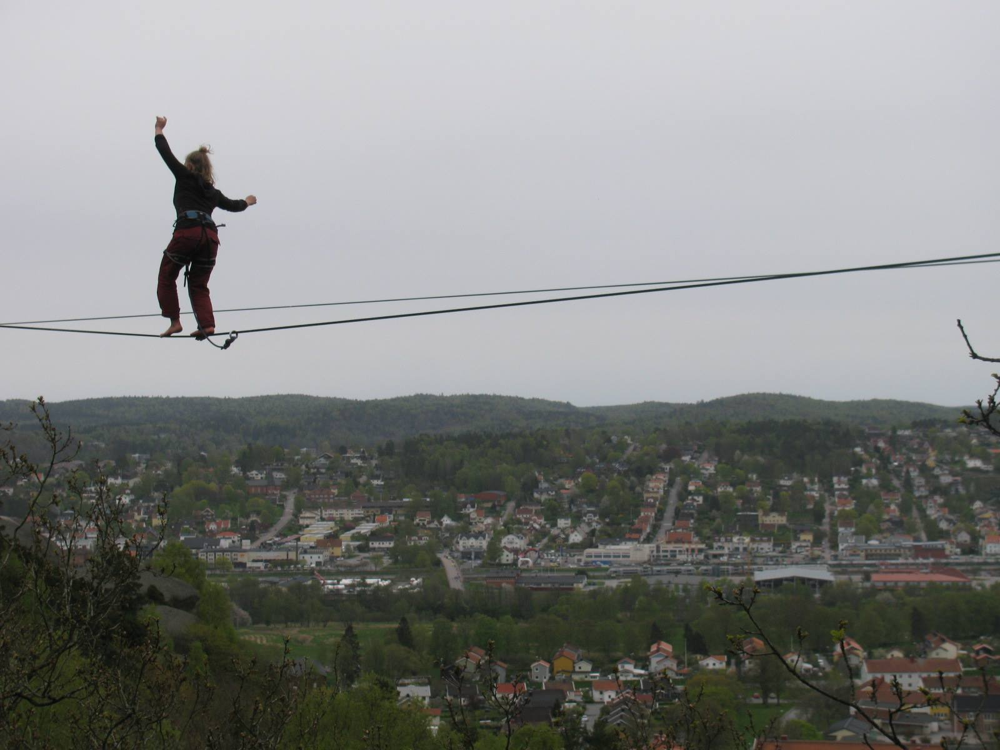
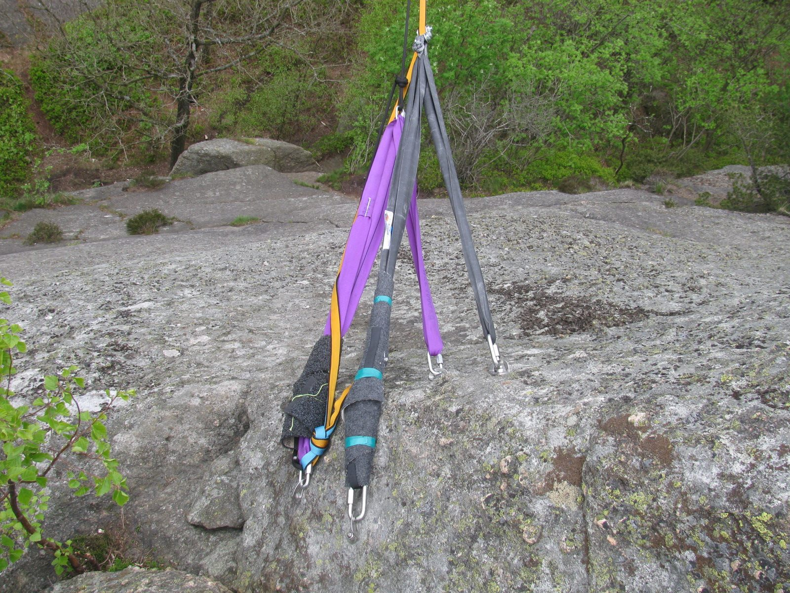
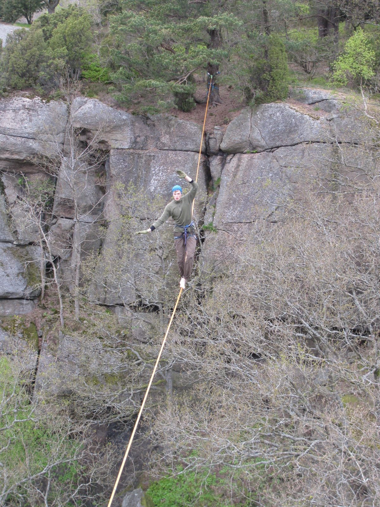

Don Genaro highline
===================

This is a [highline in Utby, Göteborg](gothenburg-highlines.md).

Length: 50m; height: 30m; FA: Allan Pinhero (2014).

Above: Marianne Ahnlund on Don Genaro in May 2015. Photo: Ariel Cicero.

Rigging
-------

The line goes approximately from the climbing route Tjabo on the sector Övre väggen to the big pine tree on the other side. The connection is possible to make by throwing lines from both sides but it is difficult. We have also been using bow and arrow to do the connection.

There are four bolts on the Övre väggen. A 1m spanset is enough for a sliding X for the main and another one for the backup. Some padding is necessary near two of the bolts.

On the other side, use a 2m spanset around the tree one meter above the ground and use tree protection. This is a bomber master-point anchor. The anchor can be backed up using the same tree lower down at ground or using a smaller tree a few meters behind.

Above: Asger Limkilde on Don Genaro in May 2015. Photos: Ariel Cicero.
