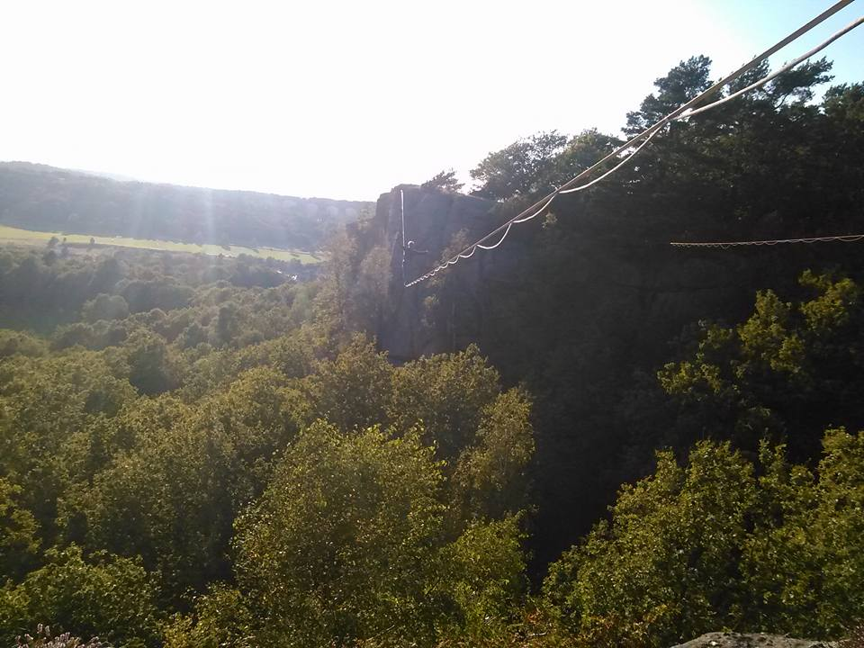
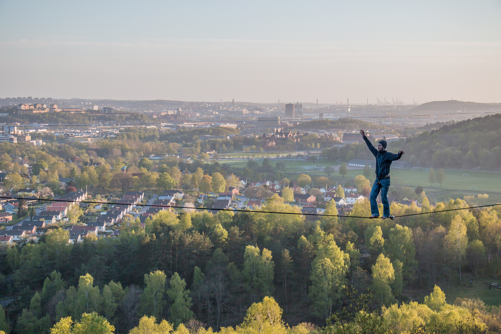
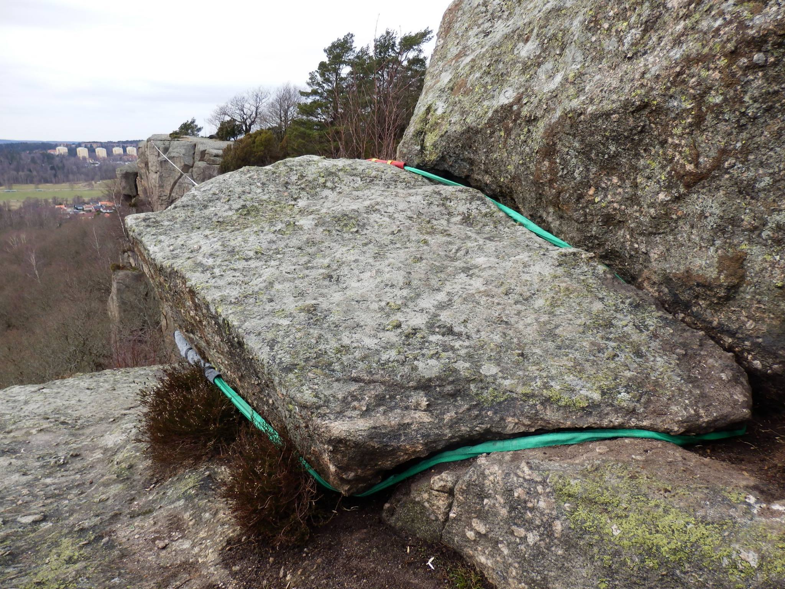
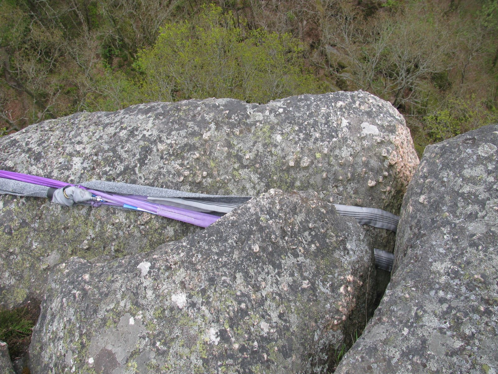
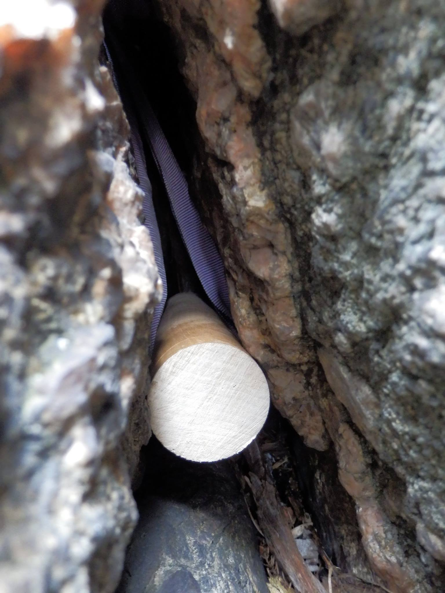
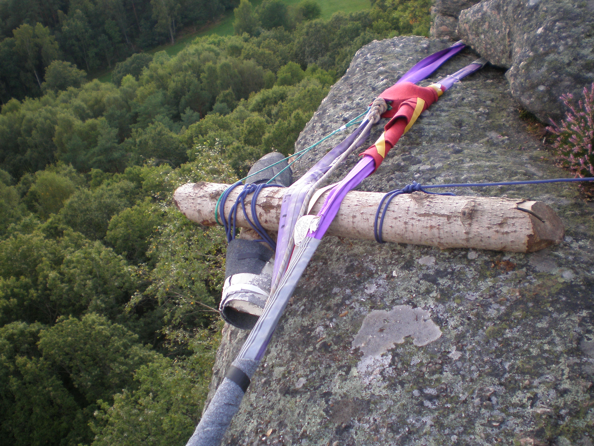

Forever Young highline
======================

This is a [highline in Utby, Göteborg](gothenburg-highlines.md).

Length: 67m; height: 30m; FA: Viktor Söderqvist (2015).

Photos by Jonas Lyckegård (left) and Martin Borgvall (right).

The line goes between the climbing wall “Övre väggen” near the end of the route “Till Susanne” to the climbing wall on the other side, near the end of the climbing route “Babianen direkt”.

There is a video of this line and [Don Genaro](don-genaro.md) filmed by Hans Kronberg using a drone here video of this line. [Watch video on YouTube](https://youtu.be/yGP5Lwc9GQM).

Rigging
-------

This line is rigged on natural anchors.

On Övre väggen, put a single 4m spanset over a rock (8m circumference) and put the front parts on top of the rock to make it level. Use a twisted shackle for the weblock. Pad the spanset in the front where it is moving on the rock. For the backup I just used a static rope around the same rock (8m).

On the other side, there is a crack that is narrow in the top and wider lower down. Put the spansets in from above, then hang down over the edge of the rock and put in a wooden stopper with a diameter of 50mm from the side. 4m of spansets is needed to extend the anchor point outside the edge. Pad the spansets inside the crack. For the backup, use another 4m of spansets and another wooden stopper in the same crack. The front is slopy both sideways and forwards. Use a log to prevent the spansets from scratching on the rock and elevate the log on one side using another log to make it level. Fix both logs using some rope to prevent them from falling down.

