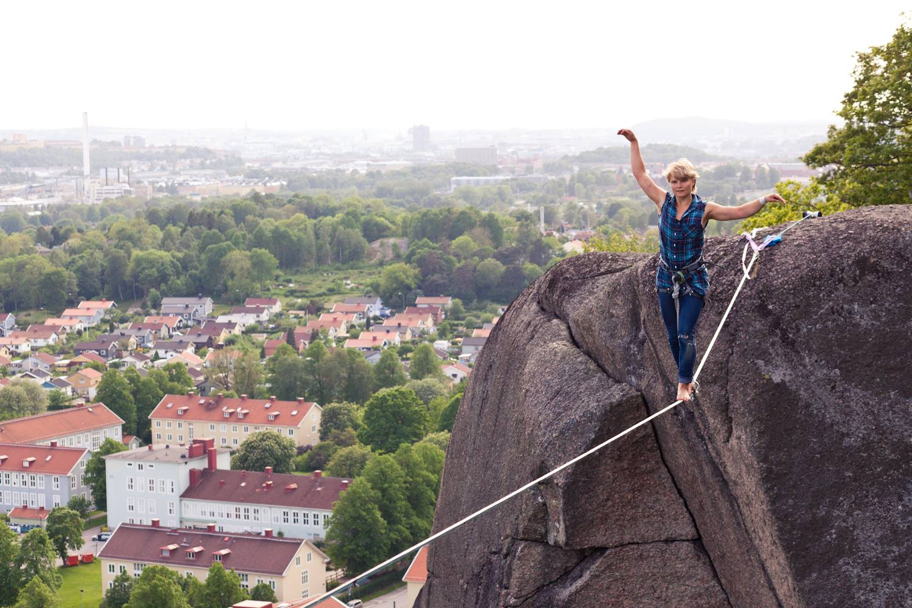
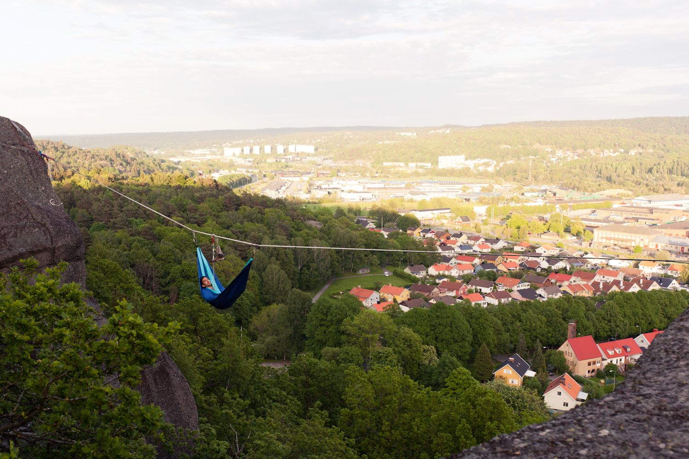

Gone With the Wind highline
===========================

This is a [highline in Utby, Göteborg](gothenburg-highlines.md).

Length: 22m; height: 20m; FA: Fabricio Gatica, Marianne Ahnlund, Viktor Söderqvist (2014).

Above: Marianne Ahnlund on Gone With the Wind in May 2014. Photo by Fabricio Gatica. Fabricio in a hammock on the same line. Photo by Viktor.

This is the first highline that we rigged in Gothenburg. The first time we rigged it on cams and nuts. Not is has four bolts on each side. Both sides are easiy accessible.

It is located near the climbing route “Borta med vinden” which inspired the name of the highline.

Rigging
-------

There are four bolts on each side. The hangars are usually left on the bolts as this line is often rigged. The connection is easy to make by throwing down a rope from each side.

On the flat side, all four bolts are on the top. One 1m spanset for the main sliding-X is enough and another 1m for the backup. A small log is useful to hold up the spansets in front of the bolts. With a log no more padding is necessary.

On the other side, two of the bolts are easy to reach. Connect yourself to one of them and then reach outside the edge of the rock to connect the other two. Some padding is needed as the spansets may move on the rock near the outer two bolts. One 1m spanset for the main and another 1m for the backup.
