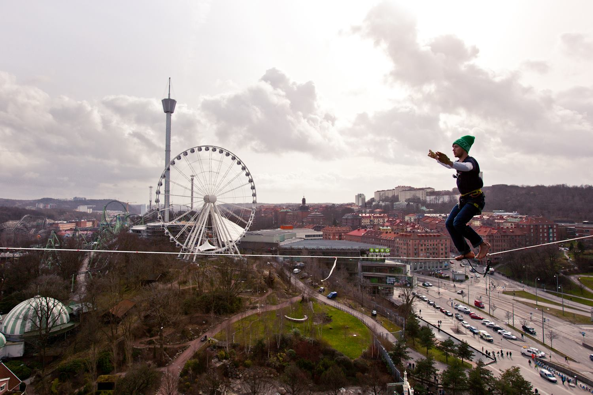

Highlines in Gothenburg
=======================

This is a small guide to the highlines in Gothenburg.

To get in touch with the local slackline community, find us in our Facebook group [Slacklife Göteborg](https://www.facebook.com/groups/215519055284206/).

Utby
----

The Utby nature area is located between the suburbs Utby and Bergsjön. This is also a popular climbing area. The lines here were establised in 2014–2015.

Overview map:

<iframe src="http://kartor.eniro.se/m/Ilc9f?embed=true&center=57.744571918686304,12.064404487609863&zoom=15&layer=hybrid"
 width="600" height="450" frameborder="0" style="border:0"></iframe>

<noframes>
<a href="http://kartor.eniro.se/m/Ilc9f">Go to map at Eniro</a>
</noframes>

Lines:

* [Gone With the Wind](gone-with-the-wind.md), 22m
* [Don Genaro](don-genaro.md), 50m
* [Forever Young](forever-young.md), 67m

Directions: You can take bus 58 to Ungmästaregatan or bus 519 to Frimästaregatan. Both these buses leave from the central station.

By car: Parking is best done on the street Kanngjutaregatan or on Gärdsåsgatan. Don't park on Ungmästaregatan. The locals don't like that.

In May 2015 we had a highline meeting here. Martin Borgvall took some [photos that are available on his website](http://www.illbattingbild.com/highline).

Gothia Towers
-------------

In 2014 there was a 25m/60m line rigged between the hotel towers and walked by Stefan Drouget, Olle Romberg and Petter Edderkopp.

Above: Stefan Drouget on the Gothia Towers line. Photo by Fabricio Gatica.

There are a few videos from this event:

* [Olle Romberg's exposure turn and leash fall](https://www.youtube.com/watch?v=ml0JszGnXdg) (YouTube)
* [Stefan Drouget's walk, from chest-mounted camera](https://www.youtube.com/embed/e_wk2X3J2s0) (YouTube)
* [Stefan Drouget's walk, from below](https://www.youtube.com/watch?v=eU9BlVg9tVI) (YouTube)

Götaplatsen
-----------

In 2013 Faith Dickey did an attempt to walk a 100+ meters highline over Götaplatsen. This was a one-time event sponsored by Volvo.

