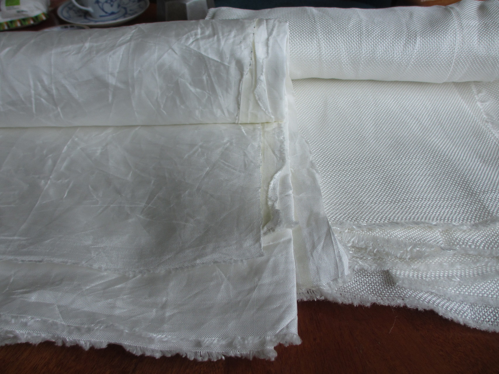

Home
====

My name is Viktor Söderqvist and I make soft shackles and other rope work out of [UHMWPE fiber](uhmwpe-fiber.md), A.K.A. Dyneema.

Please send an email to *viktor @ (the domain of this website)* if you have questions, feedback or if you want to order something. I make soft shackles of various sizes, whoopie slings, etc. I use them for slackline but they are useful in sailing and lots of other things too.

The source code and the complete history of this website is available on [my github account](https://github.com/zuiderkwast/zuiderkwast.se).

