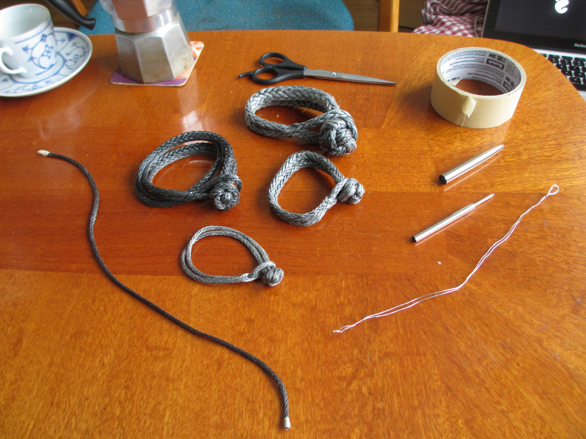

Soft shackles
=============

Soft shackles are a lightweight alternative to steel and aluminium schackles and carabiners. While mainly used in sailing, they are gaining popularity in slacklining and they have potential use in other sports and activities. Typically, they are made of [Dyneema/UHMWPE fiber](uhmwpe-fiber.md).

Benefits compared to the steel counterpart:

  * Strong – comparable to steel at the same thickness;
  * light – strength-to-weight ratio more than ten times that of steel;
  * abrasion-resistant, very low friction, UV resistant and all the other benefits of the [UHMWPE fiber](uhmwpe-fiber.md);
  * easy to make yourself;
  * cheap – if you *make them yourself*.

*Note:* Don't use shoft shackles in the presense of sharp edges as these can cut through the material.

How to make soft shackles
-------------------------

It is easy to make soft shackles and there are many resources online. As a starting point I recommend the soft shackle articles at [L-36.com](http://l-36.com/soft_shackles.php?menu=4). You don't even need any special tools to make shoft shackles. The interior of a pen can be used as a splicing tool.

Above: Soft shackles in various lengths and thicknesses with a splicing tools for each of the line thicknesses.

There are several variations of the design. My favourite variant is the *High strength soft shackle* which involves a [button knot](http://l-36.com/button_knot_top.php) (credited to Brion Toss) although different variations have their pros and cons. Accordning to tests at L-36.com, the strength of the *high strength* variant has 230% the strength of the line used while "conventional" soft shackles with a diamond knot have 170% the strength of the line.

<table>
<thead>
<tr><th>Line width</th><th>Line strength</th><th>Conventional soft shackle (170%)</th><th>High strength soft shackle (230%)</th></tr>
</thead>
<tbody>
<tr><td>3mm</td><td>10kN</td><td>17kN</td><td>23kN</td></tr>
<tr><td>4mm</td><td>20kN</td><td>34kN</td><td>46kN</td></tr>
<tr><td>5mm</td><td>24kN</td><td>41kN</td><td>55kN</td></tr>
<tr><td>6mm</td><td>35kN</td><td>60kN</td><td>80kN</td></tr>
<tr><td>7mm</td><td>54kN</td><td>92kN</td><td>124kN</td></tr>
<tr><td>9mm</td><td>69kN</td><td>117kN</td><td>159kN</td></tr>
</tbody>
</table>

The above table contains approximate values. The strength can vary between different types of Dyneema line. Dyneema line can be bought in sailing shops and e-stores.

Other resources
---------------

L-36.com, a yachting and sailing website, have some good articles on soft shackles:

  * [Soft Shackles](http://l-36.com/soft_shackles.php?menu=4)

Balance Community, a slackline manifacturer, have articles about soft shackles in regard to slacklining:

  * [All About Soft Shackles at Balance Community](http://www.balancecommunity.com/slack-science/soft-shackles/)
  * [Testing Soft Shackles for Weaknesses](http://www.balancecommunity.com/slack-science/soft-shackles/)
