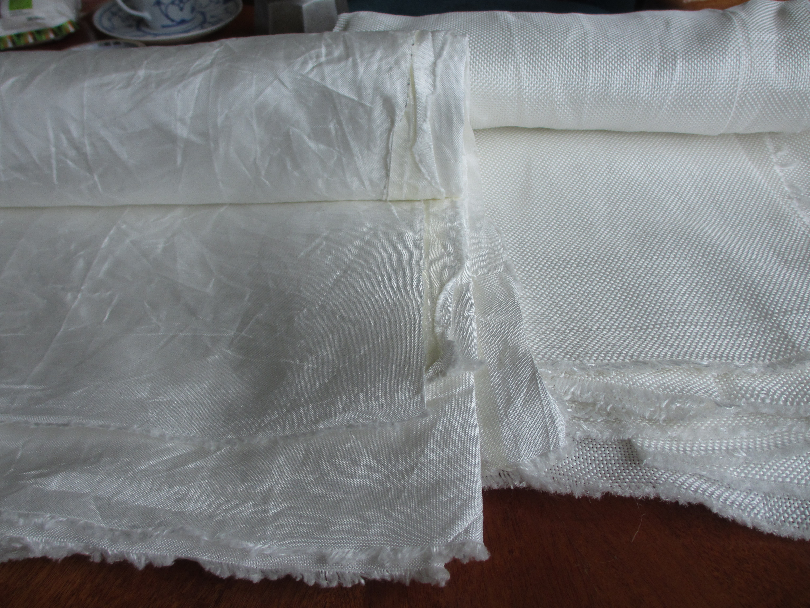
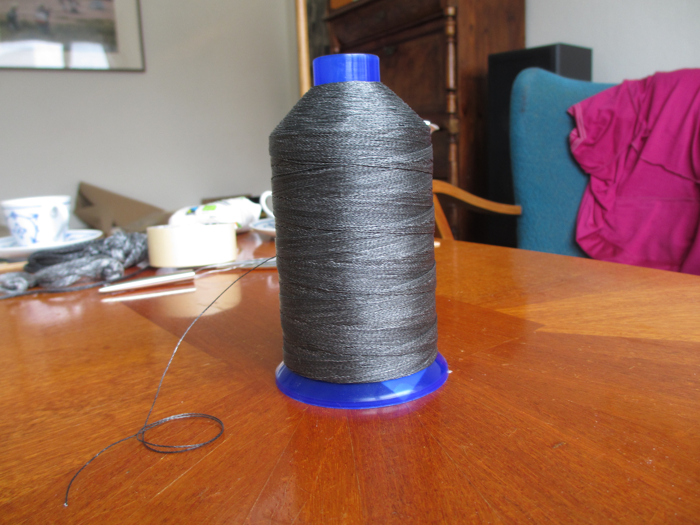

The UHMWPE fiber
================

UHMWPE is the strongest fiber in the world. It is more commonly known under the brand name Dyneema. During the spring of 2015 I became interested in this material and started to experiment with it. This is what I did:

* [Soft shackles](soft-shackles.md)
* [Dyneema trousers](uhmwpe-trousers.md)

Below: UHMWPE fabric and thread.

Further reading
---------------

  * [Ultra-high-molecular-weight polyethylene, Wikipedia](http://en.wikipedia.org/wiki/Ultra-high-molecular-weight_polyethylene)
  * [Dyneema fiber, DSM.com](http://www.dsm.com/products/dyneema/en_GB/product-technologies/fiber.html)
  * [DyneemaSK75 Tech Sheet PDF, www.pelicanrope.com](www.pelicanrope.com/pdfs/DyneemaSK75_Tech_Sheet.pdf)
