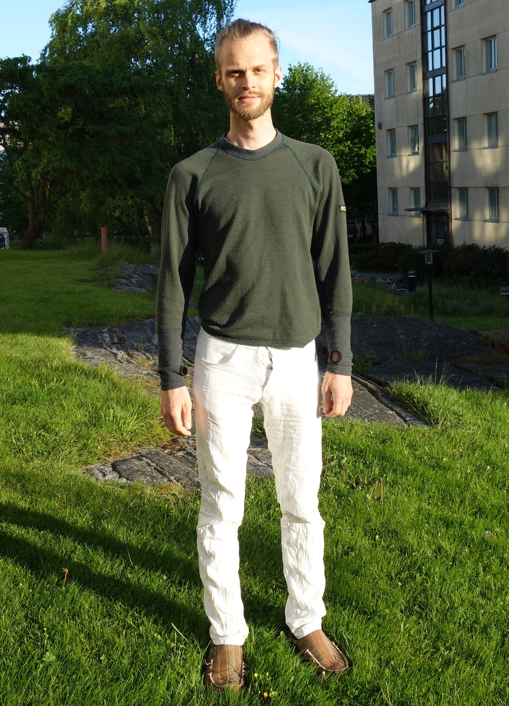
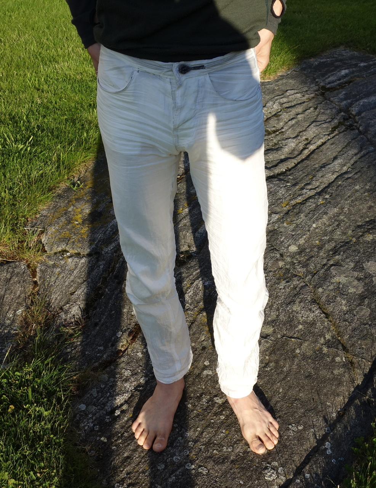
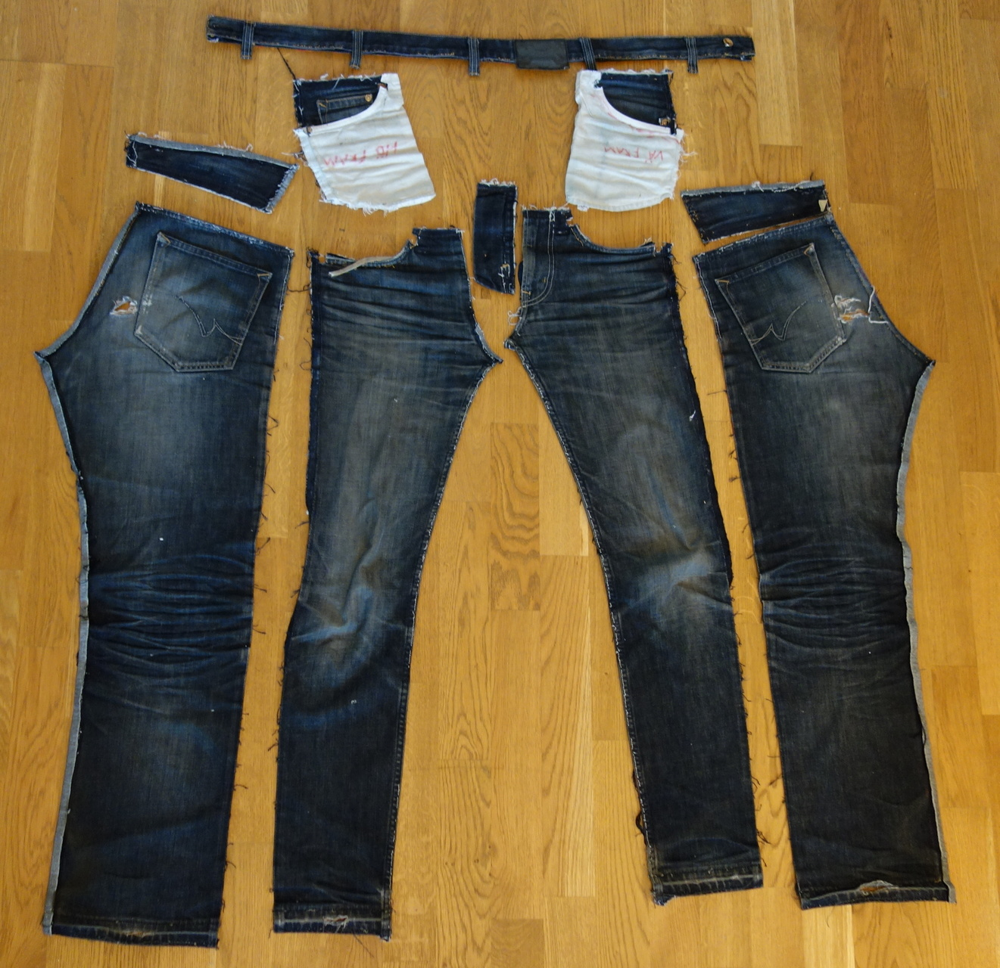

UHMWPE trousers
===============

Annoyed by the fact that my jeans never last longer than a year due to normal use including slacklining, climbing, cycling and other activities, I started thinking in terms of a way to solve this once and for all. Following my recent discovery of Dyneema/UHMWPE fiber I decided to make a pair of trousers out of this material.

The fabric I used was a 440 denier, 90 grams per meter, white fabric made of [UHMWPE fiber](uhmwpe-fiber.md). I couldn't find any other colour so I had to accept the idea of wearing white trousers.

I didn't know what to expect but I was positively suprised by the result. They are thin and light (142 grams compared to ~600 grams for orinary jeans of the same size), breathable and protects against cold winds. They are not rain proof but they dry quickly.

The sewing thread I used was a strong polyesther thread available in ordinary sewing shops. I used triple seams for the parts most exposed to wear and tear. As the yarn in the fabric is very slippery, I made very short stitches (slightly shorter than 1mm).

For the pattern, I used a pair of worn jeans that I took apart. That pair was one of my favourite but they started breaking in the ass as do all my jeans sooner or later.

Above: This is the fabric that I used with coins for comparison.

Below: During one of the sewing nights.

