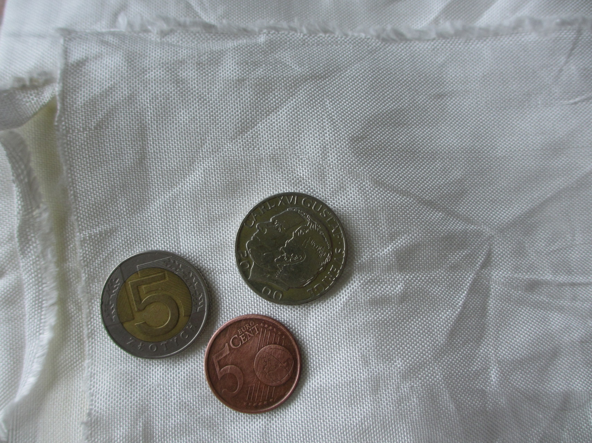

UHMWPE trousers
===============

Annoyed by the fact that my jeans never last longer than a year due to normal use including slacklining, climbing, cycling and other activities, I started thinking in terms of a way to solve this once and for all. As my recent discovery of Dyneema/UHMWPE fiber, I decided to make a pair of trousers out of this material.

The fabric I found was a 440 denier, 90 grams per meter, white fabric made of [UHMWPE fiber](uhmwpe-fiber.md). I couldn't find any other colour so I had to accept the idea of wearing white trousers.

For the pattern, I used a pair of worn jeans that I took apart. That pair was one of my favourite but they started breaking in the ass as do all my jeans sooner or later.

Above: This is the fabric that I used with coins for comparison.

Below: During one of the sewing nights.

